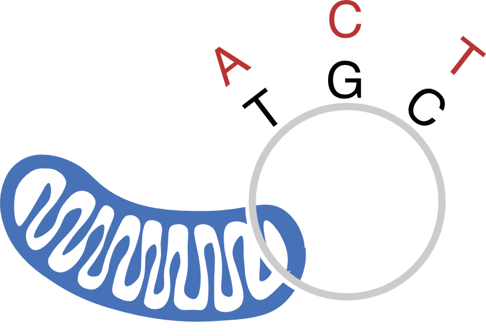
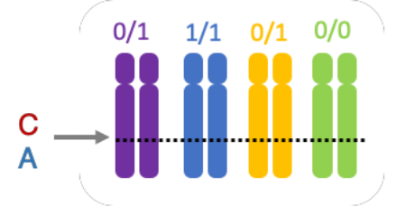
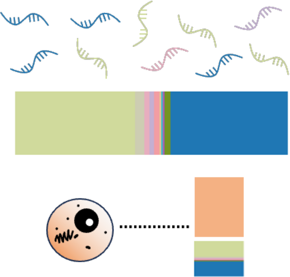
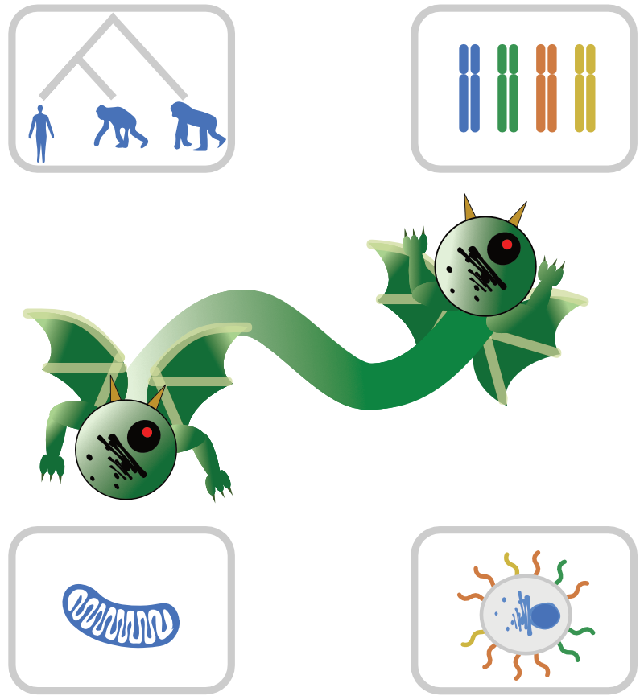
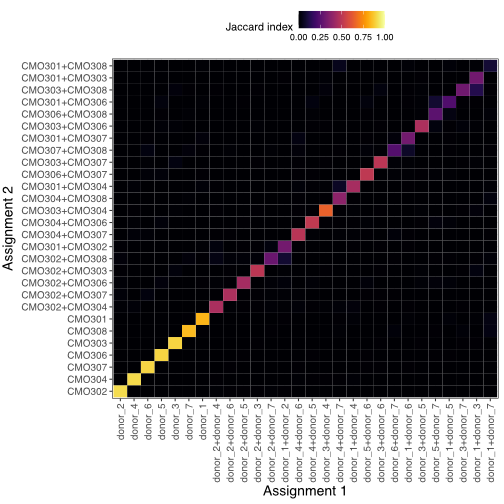

<p>

</p>

Tools for checking cell identities and keeping the riffraff out of pooled single cell sequencing data sets. 

|I want to...|I have...|Tool to use|
|------------|---------|-----------|
| Demultiplex cells by **species** |Raw reads, plus a transcriptome (FASTA) or annotation (GTF) and genome (FASTA) per species <p align="center">*OR*</p> A BAM file of reads mapped to a composite reference genome|[`demux_species`](#demux_species)|
|Demultiplex cells by **individual of origin**, and I hope individuals are unrelated enough to have different mitochondrial haplotypes|A BAM file of aligned scATAC-seq or whole cell scRNA-seq data|[`demux_mt`](#demux_mt)|
|Demultiplex cells by **individual of origin**|VCF of known variants, plus a BAM file of aligned single cell sequencing data|[`demux_vcf`](#demux_vcf)|
|Demultiplex individuals by **custom label** or **treatment**|FASTQs containing MULTIseq/HTO/CITE-seq data, or a table of pre-computed counts, optionally in [MEX format](https://kb.10xgenomics.com/hc/en-us/articles/115000794686-How-is-the-MEX-format-used-for-the-gene-barcode-matrices)|[`demux_tags`](#demux_tags)|
|Assign **sgRNAs** to cells|FASTQs containing sgRNA capture data, or a table of pre-computed counts, optionally in [MEX format](https://kb.10xgenomics.com/hc/en-us/articles/115000794686-How-is-the-MEX-format-used-for-the-gene-barcode-matrices)|[`demux_tags`](#demux_tags)|
|Quantify **ambient RNA** per cell, infer its origins, and optionally adjust gene counts|Output from `demux_vcf` (plus optional single-cell expression data to adjust, in [MEX format](https://www.10xgenomics.com/support/software/cell-ranger/latest/analysis/outputs/cr-outputs-mex-matrices))|[`quant_contam`](#quant_contam)|
|Infer global **doublet rate** and proportions of individuals|Output from one or more `CellBouncer` programs run on the same cells|[`doublet_dragon`](#doublet_dragon)|
|Determine **proportion of individuals** in a pool|A VCF of known variants, plus a BAM of aligned sequence data (can be bulk)|[`bulkprops`](#bulkprops)|

### Visualizing and comparing results

|I want to...|I have...|Tool to use|
|------------|---------|-----------|
|**Visualize** a set of labels and the pool compositions they produce at different confidence cutoffs | An `.assignments` file from a CellBouncer program |[`plot/assignment_llr.R`](docs/plot_assignment_llr.md)|
|**Compare** two sets of labels on the same cells | Two `.assignments` files from CellBouncer programs run on the same data | [`plot/compare_assignments.R`](docs/plot_compare_assignments.md)|
|**Merge** two sets of labels on the same cells into one set of labels | Two `.assignments` files from CollBouncer programs run on the same data | [`utils/merge_assignments.R`](docs/utils_merge_assignments.md)
|**Compare** two sets of pool proportions and assess significance if possible | Two files describing pool composition (i.e. from [`bulkprops`](#bulkprops) or contamination profile from [`quant_contam`](#quant_contam)), or one file describing pool composition and an `.assignments` file describing cell labels | [`utils/compare_props.R`](docs/utils_compare_props.md) |
|**Refine** genotype calls to better match cell-individual labels | A preexisting set of genotypes in VCF format, a BAM file of aligned single-cell data, and an `.assignments` file mapping cells to individuals of origin | [`utils/refine_vcf`](docs/utils_refine_vcf.md) |

### Manipulating BAM files

|I want to...|I have...|Tool to use|
|------------|---------|-----------|
|**Split** a BAM file into one file per cell identity | A BAM file of aligned single-cell sequencing data and a CellBouncer-format `.assignments` file | [`utils/bam_split_bcs`](docs/utils_bam_split_bcs.md) |
|**Tag** reads in a BAM file to mark individual of origin | A BAM file of aligned single-cell sequencing data and a CellBouncer-format `.assignments` file | [`utils/bam_indiv_rg`](docs/demux_mt.md#utilsbam_indiv_rg) |

### Manipulating gene expression data

|I want to...|I have...|Tool to use|
|------------|---------|-----------|
|**Convert** 10X or Scanpy (AnnData) data from `.h5` to [MEX](https://www.10xgenomics.com/support/software/cell-ranger/latest/analysis/outputs/cr-outputs-mex-matrices) format | A CellRanger-format [`.h5`](https://www.10xgenomics.com/support/software/cell-ranger/latest/analysis/outputs/cr-outputs-h5-matrices) or Scanpy-format [`.h5ad`](https://anndata.readthedocs.io/en/latest/tutorials/notebooks/getting-started.html) file | [`utils/h5tomex.py`](docs/utils_h5tomex.md) |
|**Subset** MEX-format data | Single-cell expression data in [MEX format](https://www.10xgenomics.com/support/software/cell-ranger/latest/analysis/outputs/cr-outputs-mex-matrices) | [`utils/split_mex_libs.py`](docs/utils_subset_mex.md) <br> [`utils/subs_mex_bc.py`](docs/utils_subset_mex.md) <br> [`utils/subs_mex_featuretype.py`](docs/utils_subset_mex.md) |

# Installation
To install ([see below](#get-the-repository)):

* Clone the repository (and its submodules)
* Choose a `conda` environment file to install
  * All necessary dependencies: `cellbouncer_minimum.yml`
  * All necessary dependencies plus extra helper programs mentioned in documentation:
    * Mac OS X: `cellbouncer_extra_osx.yml`
    * Linux: `cellbouncer_extra.yml`
* Run `make`

For more information about installing or updating CellBouncer, see [here](docs/installation_notes.md).

### Get the repository
```
git clone --recurse-submodules git@github.com:nkschaefer/cellbouncer.git
cd cellbouncer
```
### Create conda environment
#### Linux
```
[conda/mamba] env create --file=[cellbouncer_minimum/cellbouncer_extra].yml
conda activate cellbouncer
conda env config vars set LD_LIBRARY_PATH="${CONDA_PREFIX}/lib:${LD_LIBRARY_PATH}" -n cellbouncer
```
#### Mac OS X (M1)
```
CONDA_SUBDIR=osx-arm64 [conda/mamba] env create --file=[cellbouncer_minimum/cellbouncer_extra_osx].yml
conda activate cellbouncer
conda env config vars set DYLD_LIBRARY_PATH="${CONDA_PREFIX}/lib:${DYLD_LIBRARY_PATH}" -n cellbouncer
```
#### Mac OS X (Intel)
```
[conda/mamba] env create --file=[cellbouncer_minimum/cellbouncer_extra_osx].yml
conda activate cellbouncer
conda env config vars set DYLD_LIBRARY_PATH="${CONDA_PREFIX}/lib:${DYLD_LIBRARY_PATH}" -n cellbouncer
```
### Compile
```
make
```
You've now got all the programs compiled, and you can run them as long as you remember to `conda activate cellbouncer` first.

# Test data set
You can get a test data set from [this link](https://ucsf.box.com/s/wvrzl1tvdrozojlj0z4sp5fhmvqe05mu). It contains an example `.bam` file, `vcf` file, and cell hashing `.counts` file. The `README` in the linked directory will explain everything, but these give you the opportunity to test-run `demux_species`, `demux_mt`, `demux_tags`, `demux_vcf`, `quant_contam`, and `doublet_dragon`.

# Overview
The programs in `cellbouncer` are standalone command line tools. If you run one of them with no arguments or with `-h`, it will give you detailed information about how to run it. Each program uses the concept of an `--output_prefix/-o`, which is a base name that will be used for all output files.

## Output files
Demultiplexing tools all write a file called `[output_prefix].assignments`, which tells you information about each cell's identity. These files are 4 columns, tab separated: 
* cell barcode (optionally with unique ID appended; see below)
* most likely identity (doublets are two names in alphabetical order separated by `+`)
* droplet type: `S` (for singlet), `D` (for doublet), or in some cases `M` (for multiplet, 3+ individuals, so far only considered by `demux_tags`)
* ratio of the log likelihood of the best to the second best assignment (a measure of confidence in the assignment)

## Cell barcode format and merging with other data
To load data from CellBouncer into a single cell analysis tool like [Seurat](https://satijalab.org/seurat/) or [scanpy](https://scanpy.readthedocs.io/en/stable/), you will need to load CellBouncer's (text format) output files and merge with your single cell data set. This requires ensuring that cell barcodes are formatted the same way by CellBouncer as in your data set. Read more [here](docs/merging.md). 

## Note about multi-library data sets
`CellBouncer` programs take input from single libraries. If you have concatenated multiple single cell sequencing data sets, `CellBouncer` will interpret all cells with the same barcode sequence as the same cell, ignoring any unique IDs you have added to barcodes. If you need to load data in [MEX format](https://www.10xgenomics.com/support/software/cell-ranger/latest/analysis/outputs/cr-outputs-mex-matrices) (i.e. for `demux_tags`) and that data comes from multiple libraries that were concatenated together, you can separate the data by library using the program [`utils/split_mex_libs.py`](docs/utils_split_mex_libs.md).

# Programs

## [demux_species](docs/demux_species.md)
<p>

</p>
Before mapping data, infer the species of origin of each cell barcode by counting k-mers unique to each species' transcriptome. Separate FASTQ files by species and optionally plot species abundances.

[more](docs/demux_species.md)


## [demux_mt](docs/demux_mt.md)
<p>

</p>
Using a BAM file of aligned scATAC-seq (ideally) or whole-cell scRNA-seq data containing cells originating from multiple individuals, infer the set of mitochondrial haplotypes in the mixture, as well as the number of individuals. Assign each cell an identity based on its likeliest mitochondrial haplotype. These assignments can then be used to label individuals of origin in the BAM, and a variant caller can then identify genomic SNPs and their genotypes in the inferred individuals.

[more](docs/demux_mt.md)


## [demux_vcf](docs/demux_vcf.md)
<p>

</p>
Given genotype data for the individuals in a pool and a BAM file of aligned single cell sequencing data, quickly infer the individual (or doublet) of origin of each cell in the pool. Confidently identifies specific doublets of origin where they occur and has been shown to be accurate even in identifying the correct contributor cell lines in the case of composite cell lines formed through inter-species cell fusions.

[more](docs/demux_vcf.md)

## [demux_tags](docs/demux_tags.md)
<p>

</p>

If you have collected [MULTIseq](https://www.nature.com/articles/s41592-019-0433-8), [cell hashing](https://genomebiology.biomedcentral.com/articles/10.1186/s13059-018-1603-1), [CITE-seq](https://emea.illumina.com/techniques/sequencing/rna-sequencing/cite-seq.html), or [sgRNA capture](https://www.nature.com/articles/s41587-020-0470-y) data, this program can count occurrences of tag/sgRNA sequences in your reads. It can then assign cells to identities from these counts, as well as inferring the proportion of counts per cell consisting of ambient tag counts. This algorithm considers combinations of multiple assignments, making it suitable for assigning guides in both high and low-MOI CRISPR experiments, although care should be taken to filter results.

[more](docs/demux_tags.md)

## [quant_contam](docs/quant_contam.md)
<p>

</p>

Once you have run [`demux_vcf`](#demux_vcf), you can use the computed allele counts and cell identities to model the rate at which cells mismatch the expected alleles as the result of ambient RNA contamination. The program `quant_contam` models the ambient RNA in the pool as originating from a mixture of individuals in the pool and estimates the contribution of each individual to this mixture. It also estimates the percent of each cell's RNA originating from ambient RNA. 

[more](docs/quant_contam.md)

## [doublet_dragon](docs/doublet_dragon.md)
<p>

</p>

After assigning cells to individuals using one or more data types, `doublet_dragon` can compile all `.assignments` files given and infer global proportions of all individual assignment types, as well as a global doublet rate, using maximum likelihood.

[more](docs/doublet_dragon.md)

## [bulkprops](docs/bulkprops.md)
<p>

</p>

If you have a VCF of known variant data for a set of individuals, and a BAM file of any type of mapped sequence data corresponding to those individuals (it need not be single cell), infer the proportion of reads corresponding to each individual. Can only use SNPs where there are no missing genotypes, but does not require very many SNPs for accuracy.

[more](docs/bulkprops.md)

## Plotting
In the `plot` directory, there are R scripts to plot output from some of the programs. If you run one with no arguments, it will tell you how to run it. Plotting programs are described in more detail on the README pages for specific tools.

`plot/assignment_llr.R`| `plot/compare_assignments.R` | 
:--------------------------:|:---------------------------------------:
  |  

Two plotting programs are useful across multiple `cellbouncer` programs, however.

#### Individual composition and log likelihood ratios
`plot/assignment_llr.R` plots a set of cell-to-identity assignments as stacked bars, to show the proportion of the pool made up of cells of each assigned identity. Along the X-axis, the heights of these bars change to show how many cells of each category would remain if the user filtered the data using the log likelihood ratio cutoff on the X-axis. This is useful for visualizing the total number of cells, pool composition, and feasibility of different filtering thresholds. To generate this plot, simply run 
```
plot/assignment_llr.R [output_prefix]
```
where `[output_prefix]` is the output prefix given to the `cellbouncer` program you just ran.

#### Comparing assignments from two methods
`plot/compare_assignments.R` compares two sets of assignments on the same cells. A typical use case for this program might be to compare the results of `demux_vcf` and `demux_mt` run on the same data set, to see whether the programs worked, and potentially to assign an individual of origin (from the VCF) to each mitochondrial haplotype. To generate this plot, run 
```
plot/compare_assignments.R [output_prefix1.assignments] [output_prefix2.assignments] [plot_out] (S)
```
where `[output_prefix1.assignments]` is the assignments file from the first program run, `[output_prefix2.assignments]` is the assignments file from the other program run, `[plot_out]` is the base output name for plots (both `.pdf` and `.png` format plots will be created), and `S` is an optional final argument that, if present, will limit the plot to show singlet identifications only.

## Other tools
The `utils` directory is the junk drawer of `cellbouncer`. It contains several programs meant for specific tasks, which can aid the above programs.
#### For species demultiplexing
|Name|Purpose|
|----|-------|
|[`utils/get_unique_kmers`](docs/demux_species.md#preparing-data)|For use in demultiplexing reads using species-specific k-mers. Takes lists of k-mers in different species' transcriptomes from [FASTK](https://github.com/thegenemyers/FASTK) and outputs lists of high-complexity k-mers unique to each species.|
|[`utils/split_read_files`](docs/demux_species.md#running-in-parallel)|Splits FASTQ files (paired or not) into a set number of approximately evenly-sized chunks|
|[`utils/combine_species_counts`](docs/demux_species.md#running-in-parallel)|Combines the output of multiple runs of [`demux_species`](docs/demux_species.md) on chunks of data into a single file that can then be used to demultiplex reads|

#### For variant calling and subsetting reads using an .assignments file
|Name|Purpose|
|----|-------|
|[`utils/bam_indiv_rg`](docs/demux_mt.md#utilsbam_indiv_rg)|Add read groups to a BAM file to mark cells' individuals of origin, so a variant caller can find variant sites that segregate among identified individuals|
|[`utils/bam_split_bcs`](docs/utils_bam_split_bcs.md)|Takes BAM file of aligned single cell sequencing data and an [`.assignments` file](#output-files) from a `cellbouncer` program and outputs one BAM file per identity in the `.assignments` file.|
|[`utils/atac_fq_preprocess`](docs/utils_atac_fq_preprocess.md)|Finds valid cell barcodes in scATAC-seq data (including from [10X multiome](https://www.10xgenomics.com/products/single-cell-multiome-atac-plus-gene-expression) experiments) and outputs new FASTQ files with cell barcodes inserted as sequence comments, where they can be transformed into BAM tags by some aligners.|

#### For reconciling multiple .assignments files
|Name|Purpose|
|----|-------|
|[`utils/merge_assignments.R`](docs/utils_merge_assignments.md)|Given two `.assignments` files describing the same labels (i.e. VCF and mitochondrial-based assignments for the same individuals), reconciles the two and outputs a single, new `.assignments` file (to stdout).|

#### For getting tag/sgRNA count data in the correct MEX format
|Name|Purpose|
|----|-------|
|[`utils/h5tomex.py`](docs/mex_format.md)|If you use a tool outside of CellBouncer (like [CellRanger](https://www.10xgenomics.com/support/software/cell-ranger/latest/analysis/running-pipelines/cr-feature-bc-analysis) or [kb kite](https://github.com/pachterlab/kite)) to count tag or sgRNA capture data, it might output the counts in `.h5` format. CellBouncer requires this data in [MEX format](https://kb.10xgenomics.com/hc/en-us/articles/115000794686-How-is-the-MEX-format-used-for-the-gene-barcode-matrices) instead. This program converts h5 format data to MEX format.|
|[`utils/split_mex_libs.py`](docs/mex_format.md)|CellBouncer programs expect input from a single library at a time. If you need to run [`demux_tags`](docs/demux_tags.md) on a data set that consists of multiple libraries concatenated together, this program can split the MEX-format UMI count matrix into one matrix per library.|

#### For merging multiple sgRNA assignment tables (from multiple libraries) into one
|Name|Purpose|
|----|-------|
|[`utils/combine_sgrna_tables.py`](docs/utils_combine_sgrna_tables.md)|If you have run [`demux_tags`](docs/demux_tags.md) in `--sgRNA` mode to assign sgRNAs to cells for multiple libraries from the same experiment, and you made barcodes unique by supplying the `--libname` argument for each run, this program can combine all the resulting `.table` files together into one, which can then be loaded and used to pseudobulk your data.|
