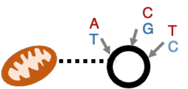

<p>

</p>

Tools for demultiplexing and keeping the riffraff out of pooled single cell sequencing experiments. 

|I want to...|I have...|Tool to use|
|------------|---------|-----------|
|Demultiplex cells by **species**|A transcriptome (FASTA) or annotation (GTF) and genome (FASTA) per species|[`demux_species`](docs/demux_species.md)|
|Demultiplex cells by **individual of origin**, and I hope individuals are unrelated enough to have different mitochondrial haplotypes|Nothing|[`demux_mt`](docs/demux_mt.md)|
|Demultiplex cells by **individual of origin**|VCF of known variants|`demux_vcf`|
|Demultiplex individuals by **individual of origin** or **treatment**|MULTIseq/HTO/CITE-seq data|`demux_tags`|
|Assign **sgRNAs** to cells|sgRNA capture data|`demux_tags`|
|Quantify **ambient RNA** per cell and infer its origins|VCF of known variants|`quant_contam`|
|Infer global **doublet rate**|Output from a `CellBouncer` program|`doublet_dragon`|

# Installation
The non-plotting programs in `cellbouncer` require only [HTSLib](https://github.com/samtools/htslib) and [zlib](https://www.zlib.net/). You can install these dependencies yourself, or to make it easier, get these and plotting-related dependencies by creating a [conda](https://github.com/conda-forge/miniforge/releases) environment from the included `cellbouncer.yml` file. Then all that's left to do is `make`:

```
git clone --recurse-submodules https://github.com/nkschaefer/cellbouncer.git
cd cellbouncer
conda env create --file=cellbouncer.yml
conda activate cellbouncer
make
```
You've now got all the programs compiled, and you can run them as long as you remember to `conda activate cellbouncer` first.

# Overview
The programs in `cellbouncer` are standalone command line tools. If you run one of them with no arguments or with `-h`, it will give you detailed information about how to run it. In general, though, each program writes output files that start with a name you give via `--output_prefix` or `-o`. 

## Output files
Demultiplexing tools all write a file called `[output_prefix].assignments`, which tells you information about each cell's identity. These files are 4 columns, tab separated: cell barcode, most likely identity, droplet type: S (for singlet), D (for doublet), or in some cases M (for multiplet, 3+ individuals, but not all programs look for these), and a ratio of the log likelihood of the best to the second best assignment. 

In output files, cell barcodes will by default be printed without any additional text (they will consist only of DNA sequences). When there are multiple data sets to be analyzed together, additional text must be appended to barcodes from each data set to prevent barcode collisions. Different programs have different conventions for handling this, such as [CellRanger](https://www.10xgenomics.com/support/software/cell-ranger/latest) appending "-" and a numeric ID (starting from 1) to cell barcodes. In [scanpy](https://scanpy.readthedocs.io/en/stable/), the [anndata.concatenate](https://anndata.readthedocs.io/en/latest/generated/anndata.AnnData.concatenate.html) command also follows this convention, unless the `batch_categories` argument is used. Some `CellBouncer` programs have a `--batch_id` argument that allows users to append unique identifiers in the same format (separated from the barcode sequence with `-`).

## Plotting
In the `plot` directory, there are R scripts to plot output from some of the programs. If you run one with no arguments, it will tell you how to run it.

# Programs
<p>

</p>

### [demux_species](docs/demux_species.md)
Before mapping data, infer the species of origin of each cell barcode by counting k-mers unique to each species' transcriptome. Separate FASTQ files by species and optionally plot species abundances.

<p>

</p>

### [demux_mt](docs/demux_mt.md)
Using a BAM file of aligned scATAC-seq (ideally) or whole-cell scRNA-seq data containing cells originating from multiple individuals, infer the set of mitochondrial haplotypes in the mixture, as well as the number of individuals. Assign each cell an identity based on its likeliest mitochondrial haplotype. These assignments can then be used to label individuals of origin in the BAM, and a variant caller can then identify genomic SNPs and their genotypes in the inferred individuals.


