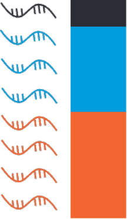

## bulkprops
<p>

</p>

If you have a VCF of genotype data for a set of individuals and a BAM file of aligned sequencing data from those individuals, which can be either bulk or single-cell (in which case cell barcodes will be ignored), `bulkprops` can infer the proportion of reads originating from each of the individuals in the pool. It works the same way as the ambient RNA profiling step in [`quant_contam`](quant_contam.md), but it can only consider SNPs for which there are no missing genotypes.

To run:
```
bulkprops -b [mapped_data.bam] -v [variants.vcf.gz] -o [output_prefix]
```
Where `[mapped_data.bam]` is your sequencing data and `[variants.vcf.gz]` is a VCF file (gzipped or not) containing genotype data for the individuals in the pool, containing at least some sites at which there are no missing genotypes (`./.`). `bulkprops` will write a file called `[output_prefix].bgprops`, which will contain these fields (tab-separated) on each line:
* An individual's name in the VCF
* The inferred proportion of reads originating from that individual

#### Optional arguments
```
--qual/q Minimum variant quality to consider
```
Set this to a high number to more strictly filter variants in the VCF.
```
--ids/-i Individuals to include
```
If your VCF file contains individuals not in the pool, make a text file listing the individuals to include, one per line. Specify the file with this option (`--ids/-i`).
```
--index_jump/-j Index jump
```
Default behavior is to read through the entire BAM file looking for SNP sites. Setting this option will instead cause the program to jump to the location of each SNP using the BAM index. This will only be faster if you have very few SNPs.


[Back to main README](../README.md)
