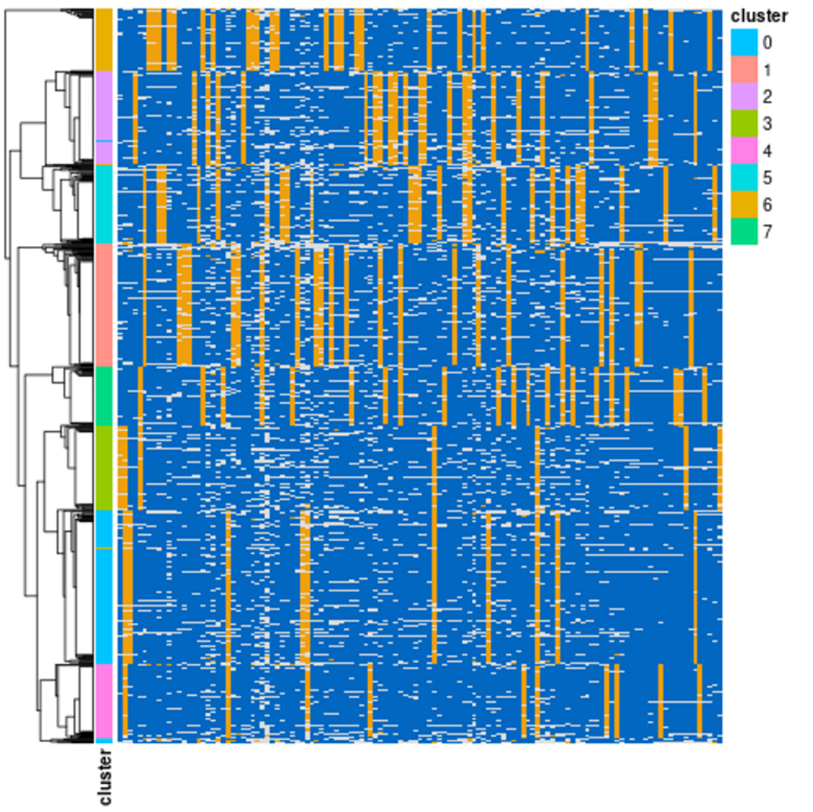
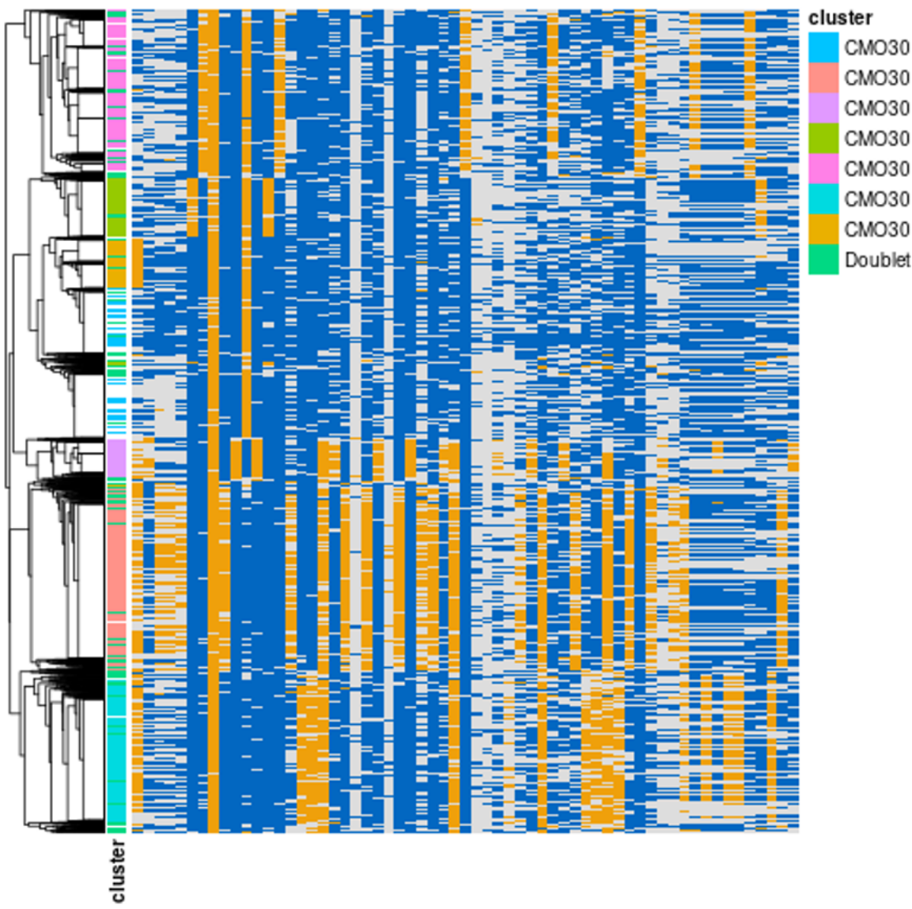
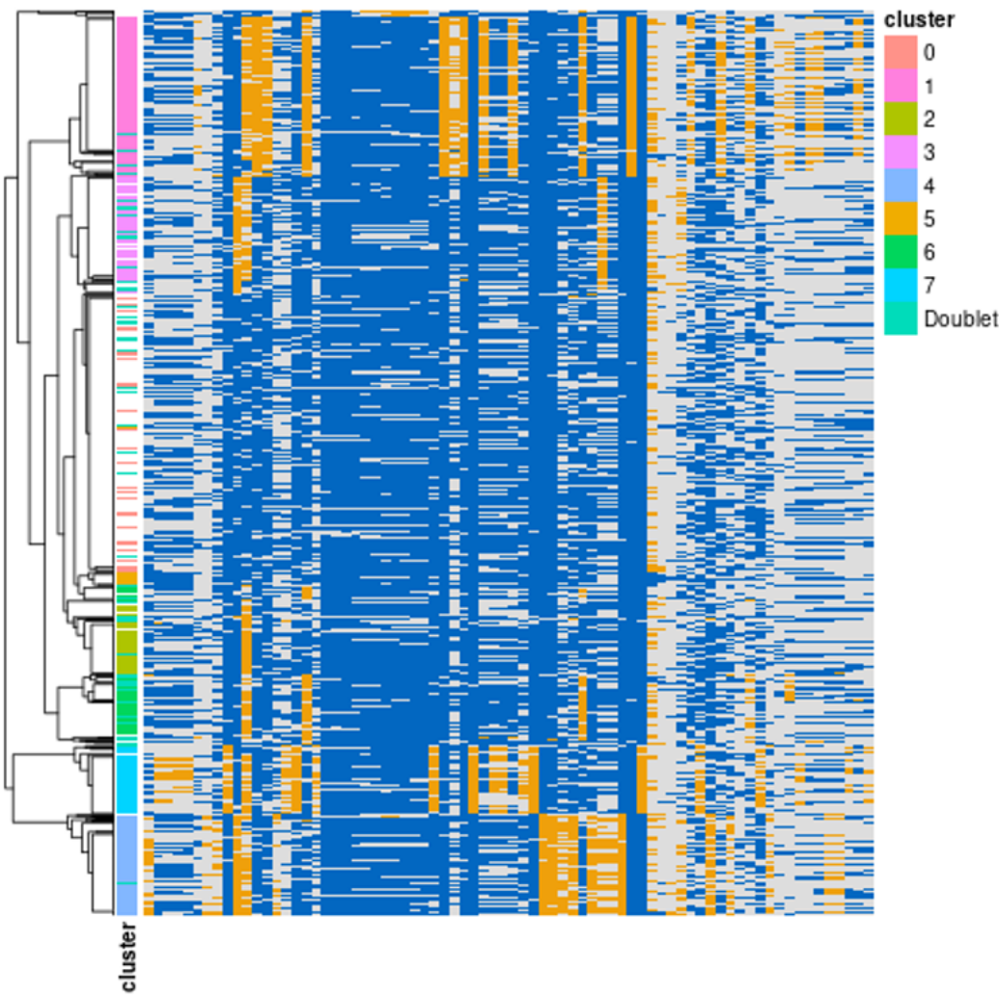
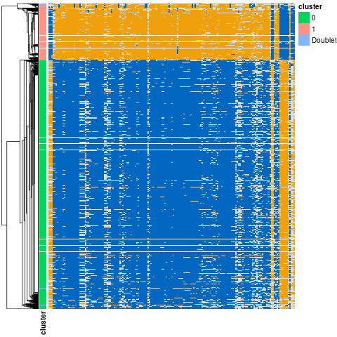
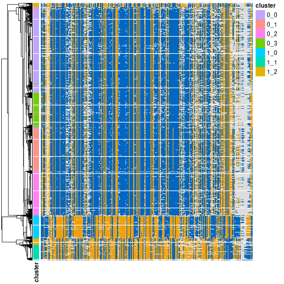

# demux_mt
<p>

</p>

## Overview
This program attempts to identify the individual of origin of each cell in a pool by inferring the mixture of mitochondrial haplotypes. It does not require any prior knowledge of variant sites or genotypes. Here are some potential use cases:

* Individuals were pooled together and sequenced with no prior knowledge of genotypes, and you want to quickly learn whether they all made it into the data set and whether they are fairly evenly represented
* Individuals that have already been sequenced were pooled together, and `demux_vcf` was used to infer the individual of origin of each cell. To ensure that this worked correctly, you want to have a second, independent identification of each cell to compare to.
* You would like to know something about the mitochondrial haplotypes present in the cells
* You want to obtain genomic variants for the individuals in your pool, without prior knowledge of genotypes of the individuals. You can use this program to get an idea of which cells come from which individuals. With this first round of cell-to-individual assignments, you can use the program `utils/bam_indiv_rg` to add read groups to the BAM that mark which individual a cell comes from, and then run a variant caller to find genomic SNPs that segregate among the individuals. If desired, you can then run `demux_vcf` using these variants, to get more confident assignments for more cells. See [Finding genomic variants](#finding-genomic-variants) section below.

## Pitfalls

* [NUMTs](https://en.wikipedia.org/wiki/Nuclear_mitochondrial_DNA_segment) are very common in some species and will attract reads away from the mitochondrial sequence, making it hard for this program to work. NUMTs are more of a problem in [non-human primates](https://www.ncbi.nlm.nih.gov/pmc/articles/PMC7671390/) than in humans. To deal with them, we recommend an approach similar to that described [here](https://github.com/caleblareau/mitoblacklist/): simulate mitochondrial reads, map to the reference genome with the mitochondrial sequence removed, run a peak caller like [MACS2](https://github.com/macs3-project/MACS) to find candidate NUMTs, and use the resulting BED file to mask the reference genome using a tool like [bedtools maskfasta](https://gensoft.pasteur.fr/docs/bedtools/2.29.2/content/tools/maskfasta.html). This must be done before aligning your single-cell sequencing data.
  * In our experience, this is unnecessary when analyzing human data.
  * When there are many NUMTs in the species' genome, taking these steps will also improve your ability to do QC using fractions of mitochondrial reads per cell.
* Some mitochondrial variants are indels. Unfortunately, this program cannot distinguish between indels and missing data/poorly covered sites in individual cells. For this reason, only SNPs can be used to build mitochondrial haplotypes.
* To identify confidently the mitochondrial haplotype of a cell, there must be a large number of reads in that cell that align to the mitochondrial sequence. Unfortunately, high numbers of mitochondrial reads are also often a [red flag](https://scanpy.readthedocs.io/en/stable/tutorials/basics/clustering.html) during quality control in single cell sequencing analysis.
  * This means that the cells most confidently assigned to an individual of origin using `demux_mt` are also often low-quality cells that will later be filtered out.
  * Because of this, if you need to identify individuals of origin and do not have variant call data, we recommend using `demux_mt`, inserting read groups to mark these inferred individuals in the BAM file, running a variant caller to genotype these individuals at genomic variants, and then running `demux_vcf` to re-identify your cells using these genomic variants. For more information, see [Finding genomic variants](#finding-genomic-variants) below.

## Running the program
To run `demux_mt` with most default settings:
```
demux_mt -b [input_file.bam] -o [output_prefix] (-c) (-m [chrM_seqname])
```
**Optional arguments**
* `-c` disables filtering candidate mitochondrial variants by coverage. This may help recover more mitochondrial haplotypes, especially if the data are noisy and/or you are working with scRNA-seq (as opposed to scATAC-seq) data.
* `-m` (the name of the mitochondrial sequence in the reference genome) is required only if it is not `chrM`.

This will create the following output files:
* `[output_prefix].vars` lists variable sites on the mitochondrial genome that compose the mitochondrial haplotypes
* `[output_prefix].haps` lists the inferred mitochondrial haplotypes, one per line, where each character is 0 (for major allele) or 1 (for minor allele), and each corresponds to a variant site in the `.vars` file.
* `[output_prefix].cellhaps` contains information used to plot mitochondrial haplotypes in individual cells. Each row represents a cell, the first column lists cell barcode, and all subsequent columns (tab separated) contain the most common allele at each variant site (or NA in the case of low coverage/missing data).
* `[output_prefix].assignments` contains the likeliest individual of origin assigned to each cell. Columns are cell barcode, individual (given as a 0-based numeric ID), droplet type (S = singlet; D = doublet), and the ratio of the log likelihood of the best to second best choice.

### Identifying cells using mitochondrial haplotypes inferred on a prior run
```
demux_mt -b [input_file.bam] -o [new_output_prefix] (-m [chrM_seqname]) \
    -v [output_prefix].vars -H [output_prefix].haps (-i [ids.txt])
```
The parameters are the same as above, but you must provide a different `[output_prefix]` this time, and provide the `.haps` and `.vars` files from the first run. Additionally, if you want to name the haplotypes, you can create a file with the same number of lines as the `.haps` file, with one name per line. Otherwise, each will receive a numeric index starting from 0.

## Plotting to check output

There are two ways to plot the mitochondrial haplotypes inferred by `demux_mt` in individual cells. These plots contain a heatmap in which cells are rows and variant sites are columns. Variant sites are colored blue when they match the major allele, yellow when they match the minor allele, or not colored (white) when they are missing in a cell. Well-defined haplotypes should be easy to identify as vertical lines in the heatmap showing many cells with the same alleles at variant sites.

In our experience, ATAC-seq data clusters well and has fairly even coverage of mitochondrial sequences. RNA-seq from whole cells works less well due to uneven coverage and missing sites, but still often finds the correct haplotypes. Single nucleus RNA-seq data (including the RNA-seq data from 10X Genomics Multiome kits) often has coverage that is too sparse to find the correct mitochondrial haplotypes.

Successful clustering (ATAC, 8 individuals)| Successful clustering (RNA, whole cell, 7 individuals) | Unsuccessful clustering (RNA, nucleus only, 8 individuals)|
:--------------------------:|:---------------------------------------:|:-------------------------:
  |   |  |

The program `plot/demux_mt_clust.R` is a good way to visually inspect the results of a `demux_mt` run. It only requires the output prefix given to demux_mt as an argument, and will attempt to hierarchically cluster all cells with at least 50% of inferred variable sites covered. In addition to plotting each cell's mitochondrial variants and clustering cells by similarity, it will show the inferred individual from `demux_mt` next to the cluster heatmap. If the number of inferred individuals is clearly discernable in the heatmap, and the color bars showing inferred individuals line up well with these inferred clusters. this is good evidence that everything worked.
* You can change the cutoff for including a cell in the plot by providing a second argument, which is a decimal between 0 and 1 representing the maximum allowable percent of variant sites that can be missing in a cell for the cell to be included. If you include too many cells with low coverage, however, you risk encountering two cells that can't be compared because they do not share any covered variant sites. If this is the case, the clustering step will fail with an error message.

The program `plot/demux_mt_unclust.R` is a way to visualize the results of `demux_mt` without hierarchical clustering. It will sort cells by their assigned individual, rather than cell-cell similarity and thus is more of a way to visualize the data than to validate results.

### Other plots
Two other plot programs can be used to plot `demux_mt` assignments from this program; see [here](../README.md#plotting).

## Subclustering

Divergent haplotypes, before subclustering (whole-cell RNA-seq data)| Same divergent haplotypes, after subclustering both clusters | 
:--------------------------:|:---------------------------------------:
  |  

Sometimes, if there are very uneven numbers of cells from different individuals, or if there are multiple deeply divergent groups of mitochondrial haplotypes (i.e. different species mapped to the same reference genome), `demux_mt` may infer a small number of clusters corresponding to these deeply divergent groups, rather than recovering all individuals. If you suspect this has happened, the program `utils/mt_subcluster.py` can perform another round of clustering on one or more of these groups. This program takes as input the results of a `demux_mt` run, and the names of one or more clusters/inferred individuals to subcluster. It then re-runs `demux_mt` on cells from each cluster individually, looking for more groups, and then merges all of the results together into one set of output files, using the program `mt_merge_hierarchical.py`. The result is a set of output files with the new given output prefix, along with plots (above) to inspect.

## Finding genomic variants

If you want to use this tool to identify the individual of origin of most of your cells but do not have genotyping data from the individuals that were pooled together, you can use `demux_mt` to get a foothold. 

### utils/bam_indiv_rg
After running `demux_mt` and validating the results, run the program `utils/bam_indiv_rg` to add [read group](https://gatk.broadinstitute.org/hc/en-us/articles/360035890671-Read-groups) tags to the BAM file indicating which individual each read belongs to (via the SM field). You should run `utils/bam_indiv_rg` with the same BAM file (as `-b`), the output `.assignments` file (as `-a`), and the name of a new BAM file to create (as `-o`). You may also filter the assignments by confidence using the `-l` parameter with a log likelihood ratio cutoff. The resulting BAM file will be a copy of the original, limited to cell barcodes that appeared in the `.assignments` file and containing read group information. 

### Creating and filtering VCF
After indexing the new BAM file with [`samtools index`](https://github.com/samtools/samtools), you can run a variant caller such as [FreeBayes](https://github.com/freebayes/freebayes) or [GATK](https://gatk.broadinstitute.org/hc/en-us) on this file. This will create a [VCF](https://samtools.github.io/hts-specs/VCFv4.2.pdf) file of genomic variants that segregate among the individuals inferred by `demux_mt`.

You should clean up the resulting VCF to discard low-quality variants, indels, fixed alleles, and sites where genotypes are missing in most individuals. This can be accomplished with [bcftools](https://samtools.github.io/bcftools/). An example command might be 
```
bcftools view -O z -v snps -m 2 -M 2 -i "(QUAL >= 100) & (F_MISSING < 0.5)" [input.vcf.gz] > [output.vcf.gz]
```
This command filters to only biallelic SNP sites with a minimum variant quality of 100, where fewer than 50% of individuals have missing genotypes. Another good strategy might be to filter out genotypes called from low coverage, and then drop sites with few called genotypes or where the allele is no longer polymorphic in the filtered set.

If working with compressed VCF files, `bcftools` (and other programs) will often require these files to be indexed for quick retrieval of variants from specific genomic regions. This requires that you use [`bgzip`](http://www.htslib.org/doc/bgzip.html)
 to compress your VCF file (instead of `gzip`) and that you then index using [`tabix`](http://www.htslib.org/doc/tabix.html). This can be accomplished with the command `tabix -p vcf [filename.vcf.gz]`.
 
### Demultiplexing using variants
If you are left with at least several hundred thousand variants (although fewer is still possible), you should now be able to run [`demux_vcf`](demux_vcf.md) with your BAM file and these variants to more confidently identify a higher number of cells than using the mitochondrial identifications alone. 

If you really wanted to get wild, you could even run `utils/bam_indiv_rg` with the `.assignments` file from this run of `demux_vcf` to make a new BAM with read groups from these latest assignments, then repeat variant calling to potentially find more variants and run `demux_vcf` again. Each time you do this, you need to be careful to omit incorrectly-assigned cells, and we expect there to be diminishing returns in repeating this process.

[Back to main README](../README.md)
