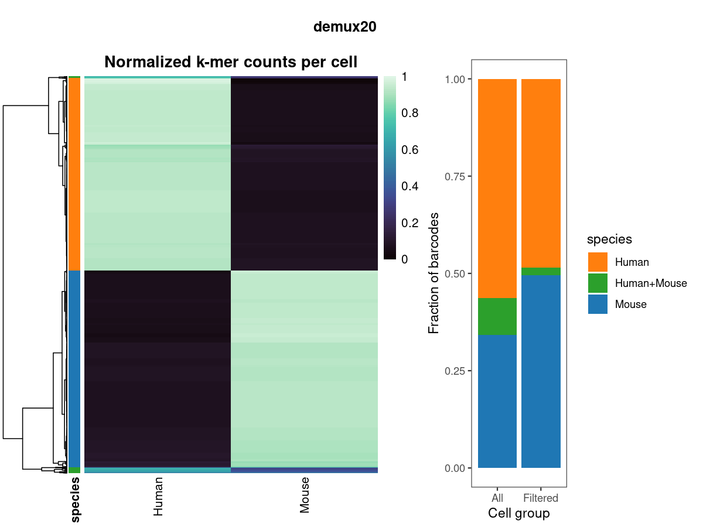

<p>

</p>

# demux_species
This program can be used before aligning your data to a reference genome. It can:

* Assign cells to species of origin
* Separate reads by species
  * In the case of multiple data types that share cell barcodes (i.e. 10X Multiome or RNA-seq + Feature Barcoding or Antibody Capture), it can determine species of origin from the RNA-seq reads and then split up *all* types of reads using the species assignments determined from the RNA-seq alone.

## How it works
The program works by making lists of species-specific k-mers and counting them in your reads. This is most feasible for RNA-seq: since genes are under selective constraint, there is a smaller space of possible k-mers in the transcriptome than there are in the entire genome. Because of this, scATAC-seq might be computationally prohibitive to demultiplex this way (unless it's from multiome data, as described above). But in principle it should work. If you want to try, using the `--limit_ram`/`-l` argument will cause `demux_species` to load and count only one species' k-mer sets at a time, resulting in slower execution but lower peak memory usage.

The steps involved are:
1. Prepare reference data (count k-mers and create unique k-mer lists)
2. Count unique k-mers in reads and produce a table of counts (collapses duplicate reads using UMIs)
3. Fit a multinomial mixture model to the counts to assign cells to species
4. If desired, split apart reads into separate files by species, so they can be mapped to a species-specific reference genome (allows up to one mismatch in cell barcode sequences)

## Another way to do it
If you would rather map to a composite reference genome, you can still use `demux_species` to assign reads to species after you've aligned. This might be preferable if you have ATAC-seq data because of its much larger k-mer space (see above). If you do try to demultiplex ATAC-seq data using the k-mer counting method, we'd like to hear how it goes. 

Alternatively, if you map reads to a composite reference genome, you can use [`utils/composite_bam2counts`](#counting-reads-on-a-composite-reference-genome) to count reads per cell mapped to each species' reference genome, and then run `demux_species` to assign cells to species of origin and optionally demultiplex reads. `utils/composite_bam2counts` assumes you have prepended or appended a species-specific unique ID to the name of every chromosome/scaffold in the composite reference genome. It then will output a table of counts, where counts are numbers of reads per cell mapped to each species in the composite reference, rather than numbers of unique species-specific k-mer counts per cell. Then simply run `demux_species` with whatever `--output_prefix` you provided to `utils/composite_bam2counts` and it will load the counts. This will be fast, unless you choose to also split reads by species, which will take more time.

## Preparing input data (k-mer counting method)

You must first build a set of reference k-mers. To accomplish this, there is a program called `utils/demux_species_ref.py`. In order to run it, you must have [`FASTK`](https://github.com/thegenemyers/FASTK) available in your `$PATH`, or provide it via the `--FastK` argument. If you want to extract transcript sequences from a genome FASTA and an annotation GTF/GFF3, you must also have [`gffread`](https://github.com/gpertea/gffread) available in your `$PATH` or provide it via the `--gffread` argument. If you already have a FASTA file per species containing spliced transcripts, then you do not need `gffread`.

To run the program:
```
utils/demux_species_ref.py -k [length] -o [output_prefix] \
    -n [species1_name] [species2_name] ... \
    -f [species1_fasta] [species2_fasta] ... \
    (-g [species1_gtf] [species2_gtf] ... ) \
    (--FastK /path/to/FastK) \
    (--gffread /path/to/gffread)
```
* `-k` is the length of k-mer to use. Longer is better for telling apart more closely related species, but a value as low as 20 seems adequate to separate human and mouse cells. Because of the data structure we use, choosing k up to 32 comes at little computational cost. Likewise, choosing any k higher than 32 and up to 64 also comes at a similar computational cost (but higher than k <= 32). We recommend using `-k 32` if you are not sure. If you have very closely related species or if it seems not to have worked, we then recommend trying larger k-mers.
* `-o` is the base name for output files. You will provide this to `demux_species` via the `-k` argument.
* `-n` is a human-readable name for each species, without spaces (you can use underscores instead). You must provide the same number of names, in the same order, as the FASTA and/or GTF files you provide (*e.g.* if providing human and mouse data, you could set `-n Human Mouse -f hg38.fa mm10.fa -g human_genes.gtf mouse_genes.gtf`. Mixing up the order of these files will cause problems.
* `-f` is a list of FASTA files:
  * If providing FASTA files for transcript sequences, these are the only files to provide.
  * If providing genomic FASTAs and annotation GTFs, then this argument should be the genomic FASTAs.
* `-g` is an optional list of GTF files. If you used `-f` to provide reference genomes instead of transcripts, then the GTF files provided here will be used to extract transcripts from the reference genomes using `gffread.` For this, `gffread` must also either be available in your `$PATH` or you can provide the path to the program using `--gffread`.

If you would rather run the steps yourself (instead of using this helper program), or better understand what it's doing, see [here](get_unique_kmers.md).


## Running the program (k-mer counting method)

To make things simple, we have provided a [Nextflow pipeline](https://www.nextflow.io/) to run all steps. This is most useful if you have many libraries and/or reads to process. If you have a lot of sequencing data and access to a cluster, for example, you can choose to split up your reads into many pieces and count k-mers in parallel. You will only need to provide the path to a set of unique k-mer lists (see above), a [cell barcode whitelist](https://kb.10xgenomics.com/hc/en-us/articles/115004506263-What-is-a-barcode-whitelist), a list of library names, and a path to your RNA-seq data. You can also provide paths to ATAC and/or custom read types (like feature barcoding and antibody capture), and if library names for your ATAC/custom reads do not match those in the file names of RNA-seq reads, you can also provide a file that maps those library names to RNA-seq library names.

The key things you need to run the pipeline are to have [nextflow](https://www.nextflow.io/) installed, to make a parameter file, and, if you want to run on a cluster, to create a `nextflow.config` file in the same directory where you run the pipeline, with cluster-specific configuration options. 

We have provided an example parameter file in `pipelines/demux_species_example.yml`. You can copy this file to wherever you want to run the pipeline and edit to match your needs. Some key parameters are:
#### Required
* `kmers`: the base name of your unique k-mer lists (see above)
* `whitelist`: the path to the allowed barcode list for the technology you used
* `libs`: a text file listing library names, one per line. Read files should have names starting with names you provide here.
* `rna_dir`: a path to a directory containing your RNA-seq data to process
* `output_directory`: where to write results
#### Optional
* `num_chunks`: CellBouncer can split up large files into smaller pieces and run each in parallel. If you set this to 1, this option is disabled. This option is most useful if you have access to a cluster and very large input files. Otherwise, the overhead involved in splitting up files may be greater than the benefit of splitting your files up.
* `demux_pieces`: If `num_chunks > 1`, then should CellBouncer also split up input read files into pieces before splitting them by species, and then join again? Alternate behavior: demultiplex read files as a whole.
* `append_libname`: should CellBouncer add library names onto the end of cell barcodes, to prevent barcode collisions in case you plan on merging data from multiple libraries together?
* `cellranger`: should unique library names be appended as numeric (1-based) indices, instead of text strings, as CellRanger does by default?
* `seurat`: should unique library names be added to cell barcodes in Seurat format?
* `demux_reads`: should input RNA-seq reads be split up into separate files by species? By default, other read types you provide will also be automatically split up by speies.
#### Required for multiple data types
* `atac_dir` A directory containing ATAC-seq reads to separate by species, based on barcode sharing with the RNA-seq reads
* `atac_map` If files in `atac_dir` do not have the same names as those provided in the text file given to `libs`, then provide a file here listing ATAC-seq library names followed by corresponding RNA-seq library names (one per line, tab separated). If library names match, omit this parameter.
* `custom_dir`: A directory containing custom-type (i.e. feature barcoding, antibody capture, etc.) reads to demultiplex by species
* `custom_map`: This is required: the first two columns must map custom library names to data types (i.e. `CRISPR` or `Antibody Capture`). If these library names are not identical to corresponding RNA-seq library names, a third column must be included listing the corresponding RNA-seq library names. Lines must be tab-separated.

### How to run
First, make sure you have run `conda activate cellbouncer` if dependencies were installed via `conda.` Then:
```
nextflow /path/to/cellbouncer/pipelines/demux_species.nf -params-file [params.yml]
```
Where `params.yml` is the file you created by copying `pipelines/demux_species_example.yml` end edited to suit your needs.

#### Running on a cluster
To run on a cluster, you just need to have an extra file (`nextflow.config`) available in the directory from which you run nextflow, which tells nextflow how to communicate with your cluster. Specific settings will need to come from your cluster administrator.

If you are running jobs on the [Wynton](https://wynton.ucsf.edu/hpc/index.html) cluster at UCSF, your file should look like this:

```
process.executor = "sge"
process.clusterOptions = "-V -S /bin/bash"
process.penv = "smp"
```
You should also submit the pipeline command as a cluster job that has plenty of runtime. For example, on Wynton, you could wrap the command in a script called `run_demux_species.sh` that looks like this:
```
#! /usr/bin/env bash
#$ -l h_rt=36:00:00
#$ -cwd
conda activate cellbouncer
nextflow /path/to/cellbouncer/pipelines/demux_species.nf -params-file [params.yml]
```
and then run it with `qsub run_demux_species.sh`.

If a job fails, you can try again, but add the `-resume` argument to your `nextflow` command. Nextflow keeps all temporary files in a directory called `work`, where they can be accessed again if a run fails.

Once a run has succeeded and all needed files are in the `out` directory you specified, you can delete the `work` directory:
`rm -r work`

#### Note
The last step of the pipeline involves creating [plots](#plotting). Sometimes, if there are many cells and/or not enough memory on a cluster node, these plots can fail, because the hierarchical clustering involved is computationally expensive. In these cases, we chose to create empty plot files rather than allow the pipeline to crash. Therefore, if you see empty `species.png` and `species.pdf` files in a directory, you can just try to create those plots again (preferably on a machine with more memory) by running `plot/species.R`.

### How to run without Nextflow
* Run `demux_species` using the unique k-mer lists you have just created as the `-k` argument: in the example above, `-k hcm_kmers`. If you run `demux_species` with no arguments, there will be a detailed usage screen. At minimum, you will need to provide a file of forward and reverse single cell RNA-seq reads, an output prefix, a [cell barcode whitelist](https://kb.10xgenomics.com/hc/en-us/articles/115004506263-What-is-a-barcode-whitelist), and a unique k-mer set. If you have multiple types of data from cells that share the same barcodes (i.e. [10X Genomics multiome data](https://www.10xgenomics.com/products/single-cell-multiome-atac-plus-gene-expression), or [feature barcoding](https://www.10xgenomics.com/support/software/cell-ranger/latest/getting-started/cr-what-is-feature-bc) data for the same cells), you can provide these files as well. The RNA-seq alone will be checked against the species-specific k-mers, but once cells are assigned to species, the other types of reads will be split into separate files by species as well.

Some additional, optional arguments are:
```
--doublet_rate -D The prior expectation of a cell being an inter-species doublet (default = 0.5)
--disable_umis -u Do not collapse UMIs (can slightly improve speed at the risk of duplicate reads inflating species counts)
--exact -e Require exact matches to cell barcode list (will improve speed at the risk of missing some cells)
--rna_r1/-r, --rna_r2/-R = RNA-seq read pairs to demultiplex (will be used to count k-mers)
--atac_r1/-1, --atac_r2/-2, --atac_r3/-3 = ATAC-seq read triplets to demultiplex (will not be used to count k-mers)
--custom_r1/-x, --custom_r2/-X, --names_custom/-N = Custom-format read pairs, plus names of the data types they contain
--whitelist_rna/-w The allowed cell barcode list for RNA-seq reads (also used for custom reads)
--whitelist_atac/-W The allowed cell barcode list for ATAC-seq (lines in -w and -W should correspond if multiome data)
--atac_preproc/-A If demultiplexing ATAC-seq, rather than just writing out the read triplets as they came in, outputs forward and reverse read pairs of genomic sequence (with barcodes removed), with error-corrected cell barcodes inserted in sequence comments as SAM tags.
```
Cell barcodes will be error corrected in output, demultiplexed reads, to speed up downstream processing.

  * If you set the `-A` option above, ATAC-seq reads will be output as genomic read pairs with barcodes removed, error corrected, and appended to sequence comments in SAM tag form (i.e. `CB:Z:AGTGGACGTGAAGTGA`). These can then be aligned to a reference genome using a paired read aligner capable of inserting sequence comments as BAM tags: 
    * `minimap2 -a -x -sr -y`
    * `bwa mem -C`
    * `bowtie2 --sam-append-comment`
  * This program will output the following:
    * `species_counts.txt` A table of cell barcodes and counts of unique k-mers from each species
    * `species_names.txt` A file listing species names in the same order as k-mer counts are listed in `species_counts.txt`
    * `species.assignments` A file mapping cell barcodes to species (or inter-species doublets), along with log likelihood ratios/confidence of assignments
    * `species.filt.assignments` The same as above, but filtered to (hopefully) exclude many non-cell barcodes, in order to improve plotting and give a better idea of the proportions of each species in the pool
    * `dists.txt` contains parameters from the fit multinomial mixture model used to assign cells to species.
    * Subdirectories for each species, containing the input read files (with the same names), subset to only reads from cells assigned to that species
    * Species-specific [10X Genomics-format library files](https://www.10xgenomics.com/support/software/cell-ranger/latest/analysis/inputs/cr-libraries-csv), to aid in running [cellranger](https://www.10xgenomics.com/support/software/cell-ranger/latest) on data from each species separately

### Note about cell barcode lists
`demux_species` needs to check for valid cell barcodes in reads. To do this, it requires one or more [cell barcode whitelists](https://kb.10xgenomics.com/hc/en-us/articles/115004506263-What-is-a-barcode-whitelist) for the FASTQ files you provide. If using RNA-seq data only, only one whitelist is required (`-w` option). If using 10X Genomics multiome data, however, two whitelists are required, one for RNA-seq (`-w` option) and one for ATAC-seq (`-W` option). This is because these kits use separate barcodes for ATAC-seq and RNA-seq, where each ATAC-seq barcode corresponds to an RNA-seq barcode and is converted to the matching RNA-seq barcode in output data. For help finding the multiome whitelist files, see [here](https://kb.10xgenomics.com/hc/en-us/articles/115004506263-What-is-a-barcode-whitelist).
### Running in parallel
Unfortunately, matching cell barcodes to large whitelists and counting k-mers can be slow. To help speed things up, this program is designed to be multi-threaded (both the k-mer counting and read demultiplexing steps are designed to use multiple threads). You can specify the number of threads with the `-T` argument to `demux_species`.

Alternatively, if you have access to a compute cluster, `cellbouncer` has a way to split up data, run in parallel on a cluster, and join results.
* Chop up the input read files using `utils/split_read_files`
  * Usage:

    ```
    utils/split_read_files -1 MyLibrary_S1_L001_R1_001.fastq.gz \
        -2 MyLibrary_S1_L001_R2_001.fastq.gz \
        -o [output_directory] \
        -n [number of chunks]
    ```
    
  * This will create files in `[output_directory]` with the same names as the input read files, but with a 1-based numeric index appended to the end.
* Run `demux_species` on each chunk in batch mode, using the same output directory for all runs
  * Pass one forward/reverse read pair file chunk in: i.e. `-r MyLibrary_S1_L001_R1_001.1.fastq.gz -R MyLibrary_S1_L001_R2_001.1.fastq.gz` and add the chunk number, so it can be appended to output files: i.e. `--batch_num 1`
* Ensure all runs have completed successfully: there should be a `species_counts.[batch_num].txt` and `species_names.[batch_num].txt` for each run in the output directory
* Join all runs together using `utils/combine_species_counts` with `-o` set to the output directory you used and `-n` set to the number of chunks/batch numbers
* Re-run `demux_species` with the same output directory you used for all runs, but now provide all reads you would like to separate by species.

**NOTE**: k-mer sets can become expensive to store in memory. We designed our data structure to be efficient, but if you have very many or very long k-mers (and this problem may become more acute with ATAC-seq data), we provide an option called `--limit_ram`/`-l` that will only load one species' k-mer set at a time, resulting in slower execution but lower memory use. Another thing to do is try using `k <= 32`, since our data structure is most compact/efficient below that size. In our hands, `k = 30` seems adequate for distinguishing between human and chimpanzee, while `k` as low as 20 is adequate for telling apart human and mouse. More closely related species (*e.g.* chimpanzee and bonobo) may require longer k-mers, however.

You should choose the lowest value of k that gives good results. To check how well a run worked, you can [plot](#plotting) the results and see how the cells cluster.

### Counting reads on a composite reference genome
If you would rather use a composite reference genome mapping (i.e. if you only have scATAC-seq data and cannot use the transcriptomic k-mer counting method), you can use the program `utils/composite_bam2counts` to create a counts table in the format expected by `demux_species`. Run it like this:
```
utils/composite_bam2counts -b [bamfile] -o [output_directory] (-s [separator] -e [end])
```
Where `[bamfile]` is your data aligned to a composite reference genome and `-o` is the directory where the counts table and species names will be written. This assumes that the composite reference genome has the name of each species appended or prepended to the beginning or end of each chromosome/scaffold name. By default, it's assumed that species names are prepended to sequence names, separated by an underscore (`_`), but you can change the delimiter with the `-s` option and specify that species names are appended to the end, rather than the beginning, of sequence names, using the `-e` option.

After this runs, you can run `demux_species` with `-o` set to the `--output_directory` you gave above. It will then load the counts and proceed as usual. You can either use it to just assign species (it will create `species.assignments` and `species.filt.assignments` files in the output directory), or to assign species and demultiplex reads (if you give it read files to demultiplex).

One thing to be cautious of when using data mapped to a composite reference genome is that misassemblies specific to one genome can attract repetitive reads from all species -- i.e. if there is a long run of G bases in one but not other genomes, then all low-quality reads containing runs of Gs risk aligning to that region and inflating the counts for that species. To avoid this, you should try masking low-complexity regions in your composite reference by using a tool like [GenMap](https://github.com/cpockrandt/genmap). 

### Plotting
<p>

</p>

Run `plot/species.R [output_directory]` after a `demux_species` run to create a summary plot.

The left panel contains a heatmap of species-specific k-mer counts in cells, clustered by cell-cell similarity and with the inferred identity of each cell shown as color bars on the left side. If the color bars do not line up well with groups of cells, something may have gone wrong with assigning cells. The right panel shows the proportion of cells assigned each identity, both in the full set and the filtered set of cell barcodes. The unfiltered/left bar plot represents what will go into the separated FASTQ files (filtering will be done later, during QC after alignment). The filtered/right bar plot is likely a better reflection of the true proportions of species in the pool.

[Back to main README](../README.md)
