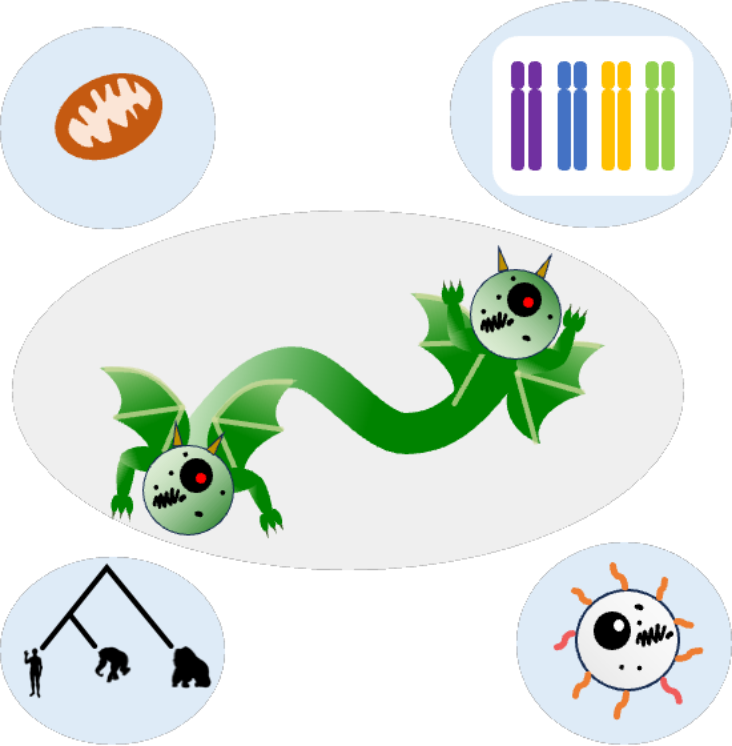
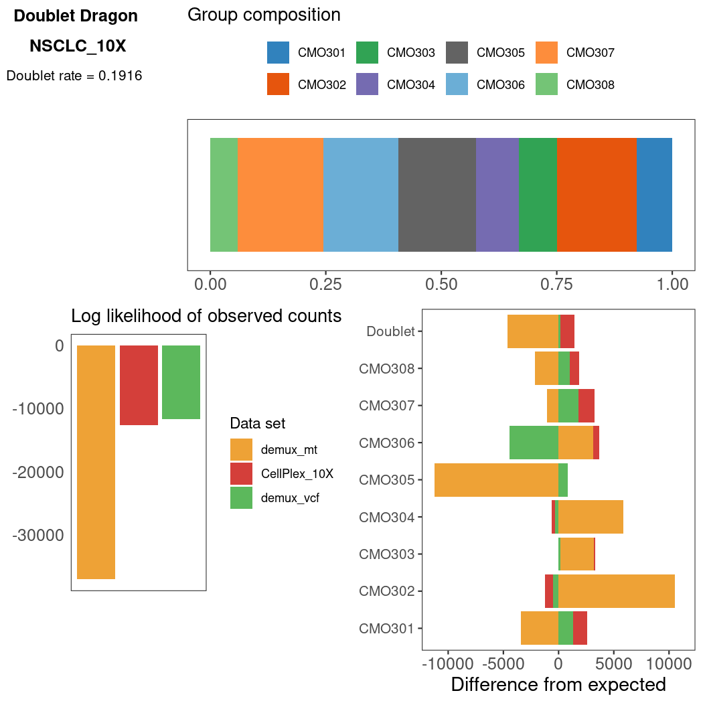
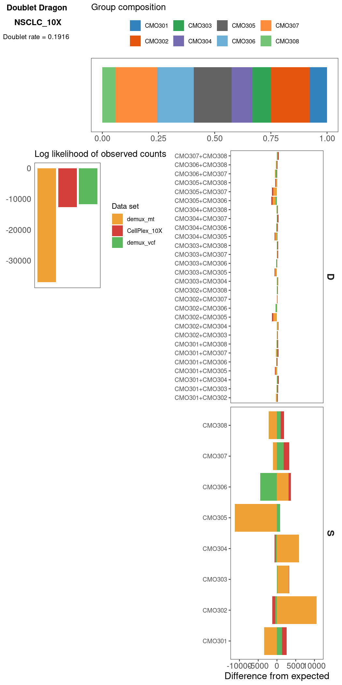

# doublet_dragon

<p>

</p>

All programs in `CellBouncer` that assign cells to individuals are also capable of classifying cells as doublets (or multiplets, in the case of `demux_tags`). Each set of identifications can end up with a different doublet rate, however, depending on how reliable each piece of information is, how many data were collected for each data type, and other factors. 

Additionally, each program infers only specific types of doublets. For example, using `demux_species` allows you to see inter-species doublets but not within-species doublets and `demux_vcf` allows you to see inter-individual doublets within the same species, but not same-individual doublets. For the sake of quality control, and to form an expectation when running a program like [scrublet](https://github.com/swolock/scrublet) to find inter-cell type doublets, it can be helpful to have an estimate of the global doublet rate in the data set. Users should typically have an expectation of this value beforehand, based on how many cells were loaded.

The program `doublet_dragon` is designed to synthesize information across data types and infer, for each type of classification, the probability of each type of singlet classification in the data set, as well as a global doublet rate. If any two data sets are intended to make the same assignments (i.e. if you have identified individuals using a VCF and `demux_vcf`, and you have also labeled the same individuals using MULTIseq and assigned labels using `demux_tags`), `doublet_dragon` is capable of treating the same individual assignments as the same information across data sets, as long as they are given the same names in the output `.assignments` files.

## Running the program
To run `doublet_dragon`, simply choose an output prefix for files to be created, and pass paths to one or more `.assignments` files after the name of the program:
```
doublet_dragon [out_doublet_dragon] [output_prefix1].assignments ([output_prefix2].assignments [output_prefix3].assignments]...)
```
where `[out_doublet_dragon]` is the prefix for output files to be created.

`doublet_dragon` will output a global doublet rate, as well as the probability of sampling each type of individual in the data set, to `stderr`.

It will also create two files: `[out_doublet_dragon].dd.indv` and `[out_doublet_dragon].dd.all`. 
* `[out_doublet_dragon].dd.indv` lists information about each individual assignment in each data set, one per line.
  *  Each line lists the following fields (in order, tab-separated):
    * a data set (input file)
    * `S` (for singlet identifications) or `D` (for doublet identifications)
    * an individual assignment
    * the number of cells given that assignment in the file
    * the expected number of cells with that assignment, according to the inferred parameters
    * The probability of seeing less than or equal to this number of cells for this assignment (according to the binomial distribution CDF)
* `[out_doublet_dragon].dd.all` lists summary information about all the data sets together:
  *  When the first field is `group_` followed by a numeric index, then field 3 is the probability of encountering a cell assigned to the ID in column 2 in the ID group given in column 1.
  *  When the first field is `all`, then field 2 is `doublet_rate` and field 3 is the global inferred doublet rate.
  *  When the first field is `data_set`, then field 3 is the log likelihood of the observed data in the data set (input file) listed in column 2, according to the multinomial PMF.

## Plotting

The program `plot/doublet_dragon.R` can create a summary plot of the information output by `doublet_dragon`. To run, simply run
```
plot/doublet_dragon [out_doublet_dragon] (D)
```
where `[out_doublet_dragon]` was the first argument you gave to `doublet_dragon` (the output file prefix), and `D` is an optional argument that, if present, will include counts of all individual doublet types in the plot (default behavior is to collapse all doublets into one category called "Doublet").

This program will create one plot, saved as two files: `[out_doublet_dragon].dd.png` (rasterized, smaller file) and `[out_doublet_dragon].dd.pdf` (vector, larger file).

Without D option enabled| With D option enabled |
:--------------------------:|:---------------------------------------:
  |   |

The above plots illustrate `doublet_dragon` run on three files for the same data: a public 10X Genomics data set containing 40,000 cells from seven donors and labeled using 10X CellPlex cell hashing oligos. The output from the 10X CellPlex deconvolution algorithm was transformed into a `cellbouncer`-format `.assignments` file (`CellPlex_10X` in the plot). Then, variants were called according to the assignments from the CellPlex data, and `demux_vcf` was used to assign cell to individual (`demux_vcf` in the plot). Finally, `demux_mt` was used to infer mitochondrial haplotypes in all cells and assign cells to individuals (`demux_mt` in the plot). The plot on the left was run without the `D` option and so excludes counts of specific types of doublets, whereas the plot on the right was run with `D` and includes specific doublet types.

If you have multiple different types of assignments (i.e. MULTIseq tags labeling treatment, species assignments, and individual assignments), there will be multiple bar plots in the top right, one for each group of labels.

[Back to main README](../README.md)
