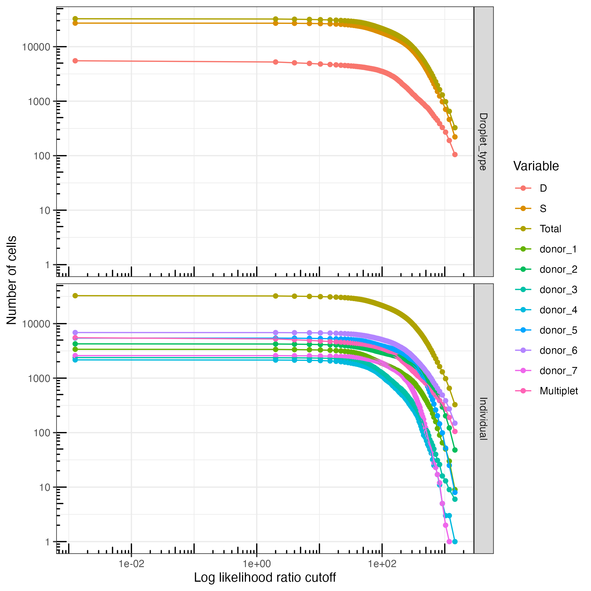

# plot/assignment_llr.R
<p>

</p>
`plot/assignment_llr.R` plots a set of cell-to-identity assignments as stacked bars, to show the proportion of the pool made up of cells of each assigned identity. Along the X-axis, the heights of these bars change to show how many cells of each category would remain if the user filtered the data using the log likelihood ratio cutoff on the X-axis. This is useful for visualizing the total number of cells, pool composition, and feasibility of different filtering thresholds. To generate this plot, simply run 
```
plot/assignment_llr.R [output_prefix]
```
where `[output_prefix]` is the output prefix given to the `cellbouncer` program you just ran.

[Back to main README](../README.md)
