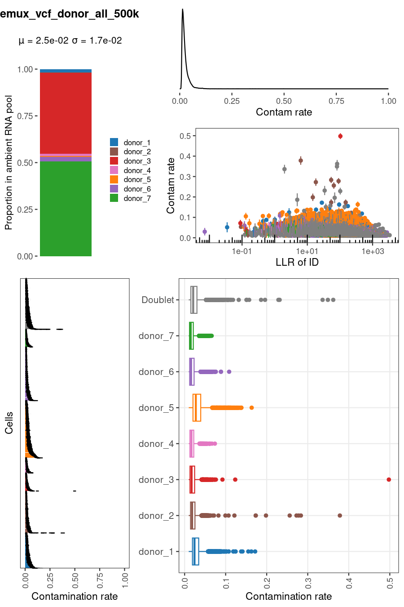
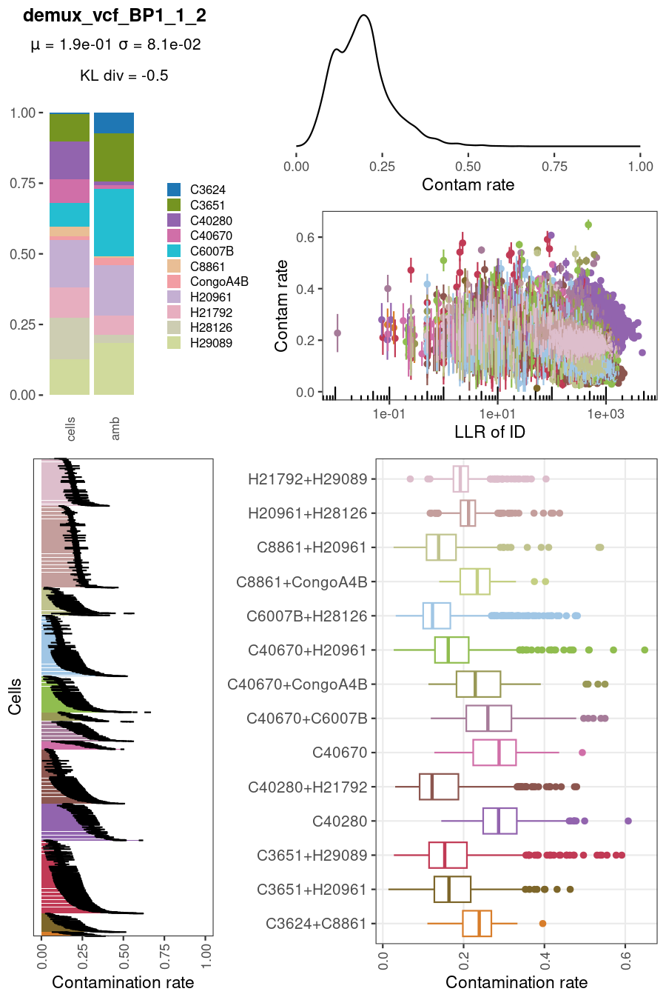

# quant_contam
<p>

</p>

After you have run [`demux_vcf`](demux_vcf.md) on single-cell RNA-seq data for which you have pre-existing variant call data for the individuals of origin, you can run `quant_contam` to profile and quantify the ambient RNA contamination in your data set.

## How this differs from other methods
Other methods for profiling ambient RNA often rely on the idea that certain genes will be more highly expressed in cells affected by ambient RNA contamination, and they infer an ambient RNA profile either by looking at gene expression in empty droplets, or by looking for aberrant expression of genes specific to certain cell types or clusters. 

`quant_contam`, however, quantifies ambient RNA contamination by seeing how often cells mismatch alleles that they should possess, according to a preexisting set of variant calls (external data). This means that `quant_contam` bases its contamination rate estimates on an external ground truth, without relying on expression patterns in empty droplets or across different user-provided cell clusters. This also means that `quant_contam` can quantify ambient RNA contamination even when it is extensive and uniform across all cells in your data set.

In addition to quantifying ambient RNA contamination, `quant_contam` models the ambient RNA as a mixture of individuals in your sequencing pool. This means that you can see whether or not specific individuals contribute an outsize proportion of the ambient RNA. If this is the case, and contamination is extensive, this could bias results in differential expression analyses downstream.

Once it has inferred the ambient RNA profile, `quant_contam` refines the cell-individual assignments it received from [`demux_vcf`](demux_vcf.md), accounting for ambient RNA contamination. It then iteratively repeats this process until the log likelihood converges. At the end, it outputs a file listing the proportion of each individual in the ambient RNA pool, the contamination rate per cell (the fraction of each cell's RNA made up of ambient transcripts), and a refined set of cell-individual assignments.

If given a single-cell gene expression matrix in [MEX format](mex_format.md), `quant_contam` will also try to correct the matrix by subtracting counts likely to result from contamination from it, in the manner of other ambient RNA removal programs. It also reports the fraction of ambient RNA inferred to originate from each gene.

## Running the program
You can run `quant_contam` in the most basic way easily:
```
quant_contam -o [output_prefix]
```
Where `[output_prefix]` is the `--output_prefix/-o` argument you passed to `demux_vcf`.
### Optional arguments
Some useful optional arguments you can provide are:
```
--ids -i If you limited demux_vcf to specific IDs using the --ids/-i argument, provide
  the same value here.

--ids_doublet -I If you limited demux_vcf to specific IDs using the --ids_doublet/-I argument,
  provide the same value here. Note that if this is provided and you also choose to decontaminate
  single-cell gene expression data (see below) and do not provide clusters, this will result in
  each doublet identity being treated as a distinct identity with its own endogenous gene expression
  profile.

--llr -l Filter the .assignments file to this minimum log likelihood ratio before inferring
  ambient RNA contamination

--no_weights -w Do not weight assignments by log likelihood ratio (see below)

--n_mixprop_trials -N When modeling ambient RNA as a mixture of individuals, the maximum
  likelihood estimation risks getting stuck in a local, not global, maximum. To avoid this, the
  first set of initial guesses can be randomly shuffled this number * the number of individuals
  times, with the highest likelihood solution taken at the end. Default = 10.

--other_species -s If your pool contained members of another species that didn't make it into
  the data set analyzed here, attempt to model other species' contribution to ambient RNA by
  adding in a fake extra individual consisting of all reference alleles.
  (see below)

--error_ref -e The underlying true error rate for misreading ref alleles as alt (default = 0.001,
  should be similar to sequencer error rate)

--error_alt -E The underlying true error rate for misreading alt alleles as ref (default = 0.001,
  should be similar to sequencer error rate)

--doublet_rate -D When re-assigning cells to individuals, very high contamination (especially from
   one individual) could result in many false doublet assignments. This forces the program to consider
   relative counts of each type of singlet and doublet and encourages re-assigned identities to conform
   to expected ratios of each (see below).

--run_once -r Instead of iterating through the process of ambient RNA profiling and cell-individual
    reassignment until convergence, does this process once and quits.

--num_threads -T Number of parallel processing threads to use in likelihood calculations. Note that
    if you do not have OpenMP available (i.e. if you compile on Mac OSX with clang, without either using
    gcc or installing OpenMP support, the likelihood and derivative calculations will be multithreaded,
    but the optimization routine (BFGS) will not be.

--bootstrap -b As a way to learn the variance of the mixture proportions of individuals in the ambient RNA
    pool, bootstrap resampling will be performed this many times. This will then add a third column to the
    output .contam_profile file listing Dirichlet concentration parameters. These indicate how sensitive the
    mixture proportion estimates are to the specific data points used to infer them. 
```
* The `--no_weights/-w` option disables weighting cell-individual assignments by log likelihood ratio (confidence of assignment). This default setting will allow more confident assignments to contribute more to inference of the ambient RNA profile. You might want to disable this if, for example, you have very different numbers of cells per different individuals in your assignments and you are worried that some individuals might mostly be noise. This would allow all cells to contribute equally to the solution.
* The `--other_species/-s` argument is designed for cases in which you have pooled together cells from multiple species, but then separated those cells by species (for example, using [`demux_species`](demux_species.md)) and mapped each group to a different reference genome. In this case, ambient RNA in each data set could have originated from another species that is not present in the data being examined. In this case, this option can include a "fake" individual in the pool consisting of only reference alleles (an approximation for another species, which should generally match the most common allele, wherever applicable).
* The `--doublet_rate/-D` option here differs from that given to other programs (such as `demux_vcf`). In other programs, the doublet rate is often used only as a prior probability of encountering a doublet identity in the data set. In this program, however, it is used as a way to overcome many false doublet assignments in extremely contaminated data sets. If you notice many more doublet identities than you expected, you can set this parameter, and it will compute the expected proportion of singlets and doublets of each type in the pool. These expectations will then feed into the log likelihood ratios between each possible pair of identities when re-inferring cells, forcing the results to conform more to expected numbers of each type of identity. The expected counts assumed here are the same as in [`doublet_dragon`](doublet_dragon.md).
* If you run bootstrapping here (enabled by default), the resulting file can then be used to test for significant differences with other files of mixture proportions; see [here](utils_compare_props.md).

### Decontaminating gene expression data
If you wish to infer the gene expression profile of ambient RNA and remove ambient counts from a gene expression matrix, you must also provide the following arguments:
```
--barcodes/-B (Optionally gzipped) cell barcode file in MEX format
--features/-F (Optionally gzipped) gene/feature file in MEX format
--matrix/-M (Optionally gzipped) matrix file in MEX format
--feature_type/-t If multiple feature types exist in the MEX data (i.e. Antibody Capture and Gene Expression),
    indicate which feature type corresponds to RNA-seq. Alternatively, you can subset the files before running
    this program, by using [utils/subs_mex_featuretype.py](mex_format.md#subsetting-to-a-data-type-or-barcode-list)
```
Optional additional arguments:
```
--clusts/-c The program must infer an endogenous gene expression profile in the data in order to infer the
    ambient expression profile. If you provide clusters here (a tab-separated file mapping cell barcode to string
    cluster names), then each cluster will have a different endogenous gene expression profile inferred. If you
    omit this argument, then the cell-individual assignments will be used to group cells, and each individual will
    have an endogenous gene expression profile inferred. Since in reality, each individual is likely to possess
    multiple biologically distinct cell types, we recommend specifying --clusts.
--round/-R Normally, the output gene expression matrix will contain fractional counts. If this is a problem for
    downstream analysis, this option rounds all modified count values, probabalistically rounding up or down to
    ensure that a reasonable number of counts will be removed (i.e. if 10,000 all cells had 0.999 count for a gene,
    rounding normally would result in all 10,000 counts becoming 1, whereas this method would result in 10 cells
    expected to have counts of zero.
```

### Output files
This program (by default) outputs the following files:
* `[output_prefix].contam_prof` lists individuals (from the VCF) and the fraction of the ambient RNA pool made up of their RNA. Each line is one individual name followed by a decimal between 0 and 1 indicating their contribution to the pool, tab separated.
* `[output_prefix].contam_rate` lists cell barcodes and the fraction of their RNA likely to have originated from ambient RNA contamination. Each line is one cell barcode followed by a decimal between 0 and 1 indicating the percent ambient RNA contamination in that cell, tab separated.
* `[output_prefix].decontam.assignments` is the refined file of cell-individual assignments, accounting for the ambient RNA profile.
#### If you provided gene expression data
* `[output_prefix].gex_profile` is tab-separated output, with rows representing genes and columns representing the multinomial parameters of gene expression in each category indicated by column headers (the first column header is ambient RNA; the others are provided clusters or cell identities.
* `[output_prefix]_mtx` is a directory that will contain (gzipped) decontaminated single cell expression data in [MEX format](mex_format.md)

### Plotting
The program `plot/contam.R` can create plots showing information about ambient RNA contamination in a data set. To run, just pass the `[output_prefix]`:
```
plot/contam.R [output_prefix]
```
Two plots will be created: `[output_prefix].contam.pdf` (vector) and `[output_prefix].contam.png` (rasterized).

#### Example plots
Low contamination data set (10X 40k NSCLC)| High contamination data set (Tetraploid composite iPSCs)|
:--------------------------:|:---------------------------------------:|
  |   | 

#### Information in the plots
* The top left corner of the plot lists the mean and standard deviation of contamination rate per cell in the data set. 
* The bar plot in the top left shows the fraction of ambient RNA inferred to have originated from each individual, in the form of stacked bars. If you have very many individuals, this information may overflow the space allocated in the plot; in that case, you will need to load `[output_prefix].contam_prof` and plot in your favorite plotting program.
* The top right corner is a kernel density curve showing the contamination rate per cell across the data set. `quant_contam` uses an Empirical Bayes prior to shrink per-cell estimates toward the mean; provided per-cell estimates are maximum *a posteriori* rather than maximum likelihood estimates.
* The panel below the density curve shows the contamination rate in each cell (Y-axis) against the log likelihood ratio of the cell's identity (X-axis). Error bars show uncertainty in contamination rate estimates (using Fisher information). Low confidence assignments may have higher inferred contamination rates, reflecting some incorrectly-assigned cells.
* The bottom left panel shows each cell's contamination rate as a horizontal bar, colored by the individual ID of each cell. Error bars show uncertainty in contamination rate estimates (using Fisher information).
* The bottom right panel shows the distribution of contamination rate estimates for cells asssigned to each individual ID as box plots, colored the same way as the bottom left panel and top left panel.

[Back to main README](../README.md)
